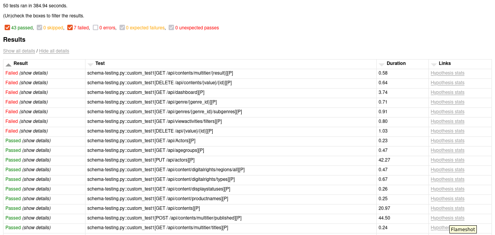
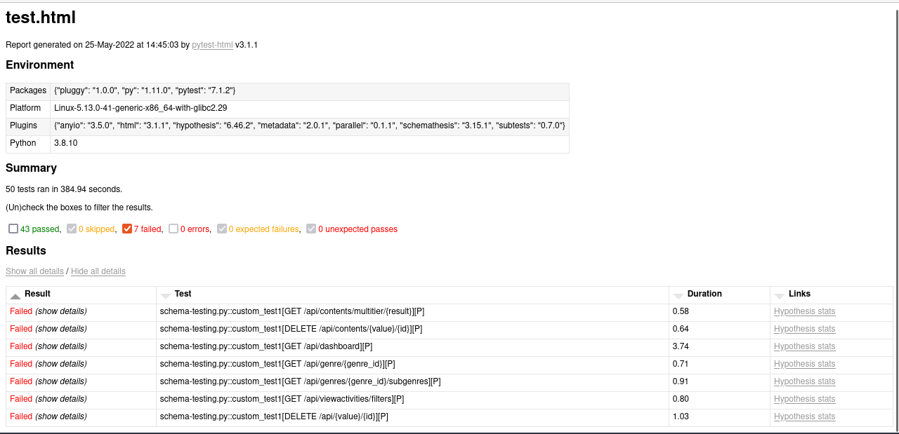
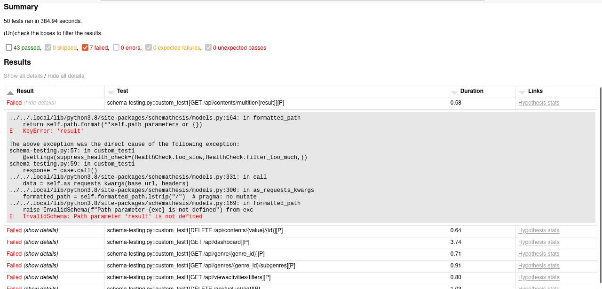

# Automated API Testing Using Python


## Overview

### What is it?

This is a Automated API Testing Framework, which automatically checks on the OpenAPI schema format, validates it. Generates random data to compare it against the server and schema provided and provides the failure cases.


### Advantages of the following Framework as compared to current Manual Testing?

1. Manual Testing requires creating Test Scripts still some of the manual response errors would never trigger because logically they will never encounter the SQL injection kind of scenarios.

2. Schema based Testing cannot be done everytime by manual testing since the schemas would be highly nested and difficult to understand if the schemas are correct or not.

3. Negative Scenarios can be verified as well. 

4. Improves and Standardizes API code quality.

5. Handles SQL Injection Queries over the API Endpoints, handles security checks and thereby, preventing data snoop through APIs.

## Pre-Requisites:

1. Python Version 3.9 or above
2. Pip3
3. Any Python Virtual Environment Wrapper (venv,pipenv) 

## Installation:

### Install the files and dependencies:

`
git clone git@github.com:engrotech/artemis.git
cd artemis
./install
`

## How to Run:

You can directly run by typing **artemis**. This would create a report.html file which can be viewed for a proper 
HTML Report of your complete test run. 

Incase, it says artemis not found you can set the path by:

`
export PATH=$PATH:$PWD/bin
`

## Commands and How it Works

The Framework uses Hypothesis for data generation and Schemathesis for validation 
based on the Swagger or OpenAPI Schema File. 


Currently **Swagger 2.0** and **OpenAPIv3** are supported. 

The Framework/Platform generates the data based on the OpenAPI Schema and validates it against the same. 

The APIs to be validated can be put into **config.ini** file and they will be automatically read and all the endpoints would be tested. 
Particular Endpoints can also be tested by adding the particular Endpoint you want to test into the config file.


Currently, For Authentication you ll have to manually generate the token and have to pass it through the header in the config file. (AUTH value)

### Commandline Reference:

**--tb=short:** Remove it if you want to generate the python code for the errors as well.

**workers 4** : Add workers for concurrent testing. Preferred value: 4-5 workers 

**tee filename.log**: Generate the log file

**-v**: Verbose mode -- Provides details on the plugins used.

### Example App:

```
cd fast-api
uvicorn main:app --reload

```

Once the server is up, you can follow the How to Run steps. Check report.html and report-neg.html for Positive Property Based Test Case and 
Negative Property Based Test Cases respectively.

### Example Demos:






## How are responses checked?

When the received response is validated,  currently we will run the following checks:

- `not_a_server_error`. The response has 5xx HTTP status;
- `status_code_conformance`. The response status is not defined in the API schema;
- `content_type_conformance`. The response content type is not defined in the API schema;
- `response_schema_conformance`. The response content does not conform to the schema defined for this specific response;
- `response_headers_conformance`. The response headers does not contain all defined headers.

## Configurations:

Use the config.conf file to add your BASE_URL (Swagger Document), ENDPOINT (To specify an Endpoint to test), Auth (To pass Auth Token) 

## Further Project Plans:

- [  ] Chained APIs Testing 
- [  ] Authentication
- [  ] Scenario Based Testing


